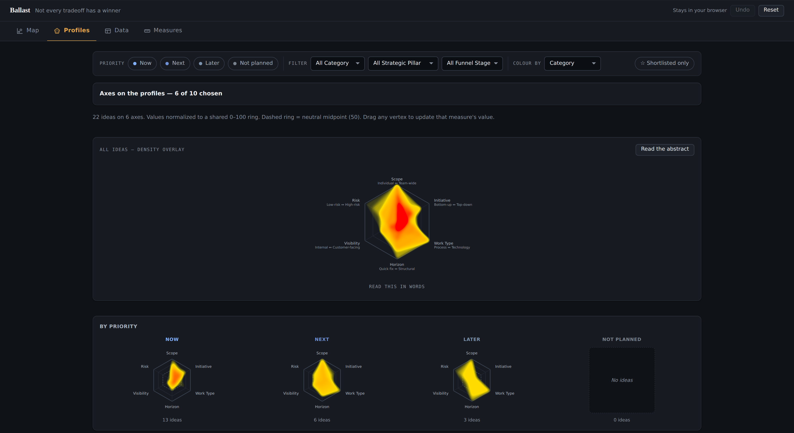
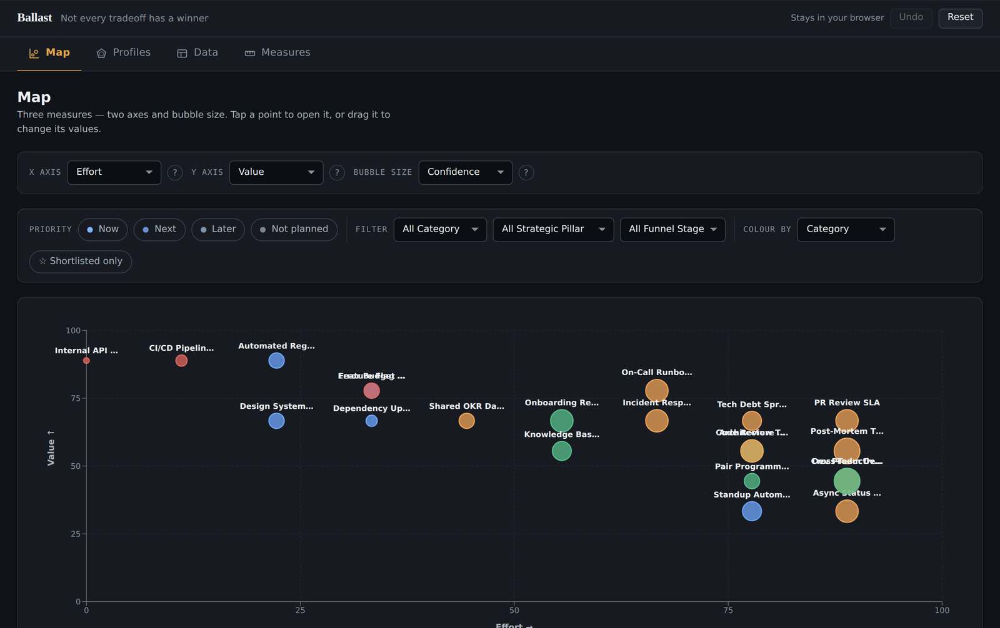
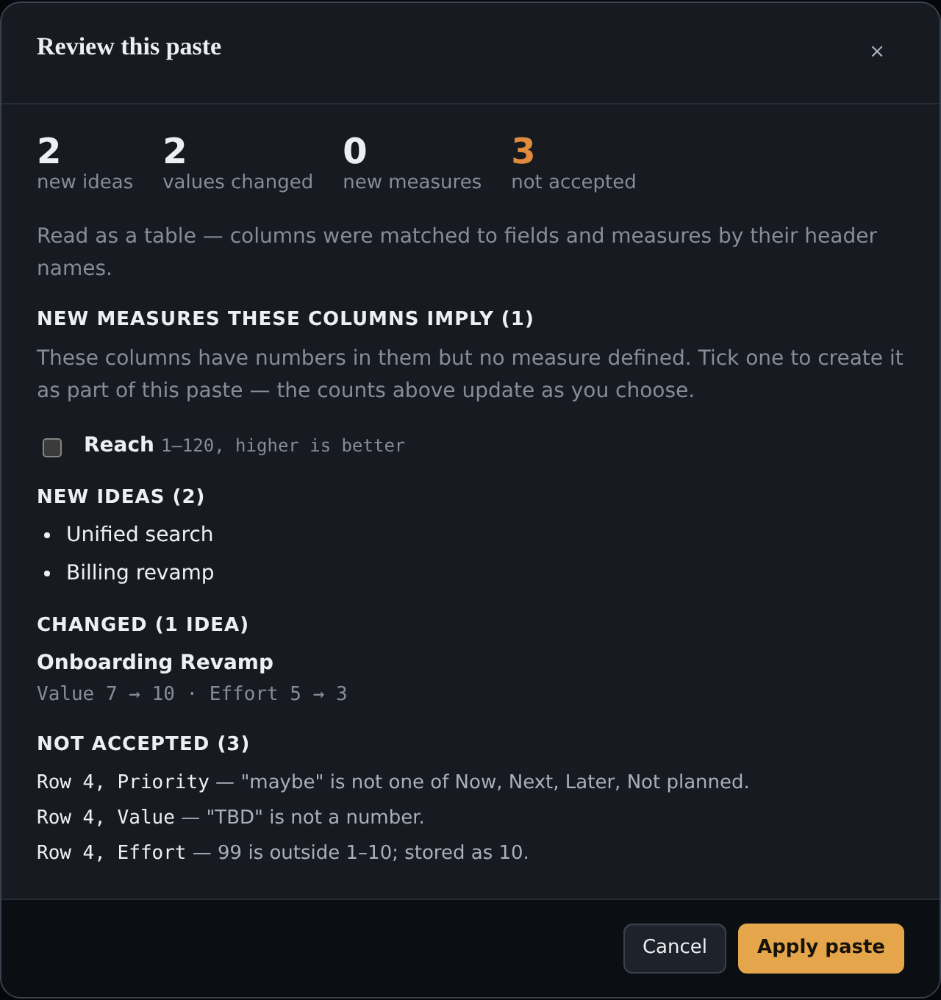
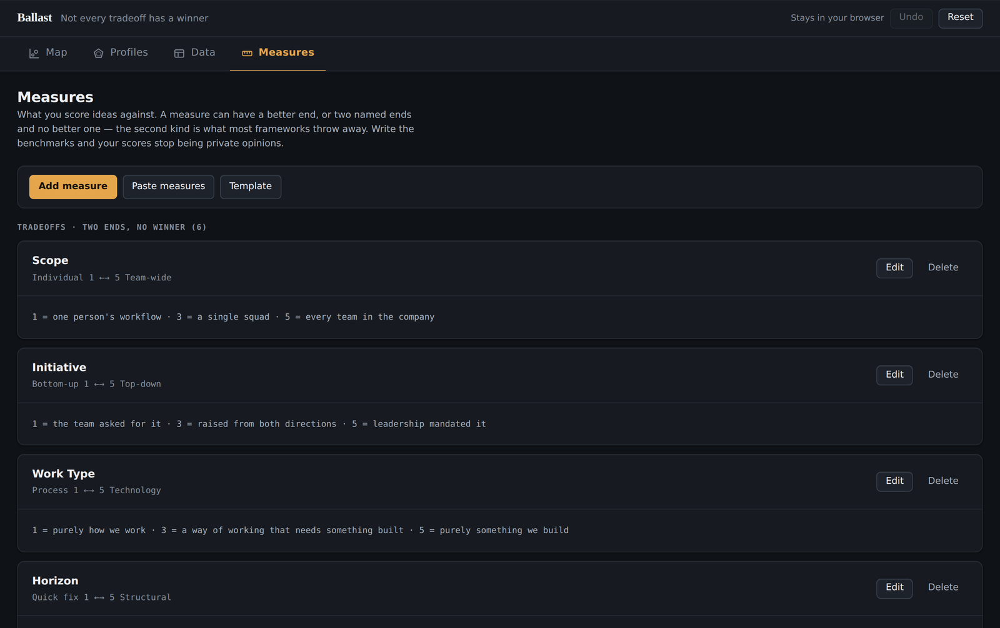

# Ballast

**Not every tradeoff has a winner.**

Prioritization frameworks exist to end meetings. RICE, weighted scoring, value against effort: they
take a decision with many dimensions, collapse it into one number, sort the list, and let the room
move on. That is a real service. It is why they are everywhere.

The cost arrives later. A good part of what actually shapes a roadmap has no better end.

> Quick fix or structural? Internal or customer facing? Bottom up or top down?
> Process change or new technology?

Neither answer is correct in the abstract. Which one is right depends on what else you are already
doing, which makes it a statement about the whole portfolio rather than about any single item. A
scoring tool has two options when it meets a question like that: turn it into a number, which quietly
asserts that one end is better, or leave it out of the artifact. Either way the question disappears
at the moment it starts to matter.

Ballast keeps those questions on the page. It plots both kinds of measure, shows the shape of the
whole set, and writes out in plain words which way that set leans.

There is no single right answer to a portfolio. That is the premise. The tool exists so you can see
the full solution space and choose a position in it on purpose, instead of finding out where you
landed two quarters later.

**→ [Try it](https://ballast.nwtnlabs.com).** No sign up, nothing to install, sample data already
loaded.



---

## Two kinds of measure

**Directional measures** have a better end. Value, effort, confidence, reach. You give them a range
and say which direction is good. Every scoring tool already handles these.

**Tradeoff measures** have two named ends and no better one. Scope runs from Individual to Team wide.
Horizon runs from Quick fix to Structural. You score each idea somewhere between the two poles, and
no score is the winning score.

Most portfolios need both. The second kind is what Ballast was built for, because it is the kind that
gets flattened everywhere else.

## The abstract

Score twenty ideas across six tradeoff axes and you have a hundred and twenty numbers. Nobody reads
that off a stack of radar charts by eye. So Ballast reads it for you:

> *Visibility leans Internal: 16 of the 16 that take a side, with nothing at the Customer facing end.*

That is a finding about a roadmap, not about an idea. Every single thing on the list that takes a
position is inward facing. Maybe that is correct, because you are paying down a platform year. Maybe
nobody noticed. Either way it is now a decision rather than an accident.

**How the sentence is produced,** because you should not trust a claim you cannot check:

1. Only tradeoff measures are considered. "Leans high on Value" would mean nothing.
2. Each idea lands in one of three buckets per measure: the low pole, the high pole, or the middle.
   The middle is a deliberate dead zone around the midpoint, ten percent of the range wide, so a
   near neutral score does not read as a vote.
3. The lean is judged only among the ideas that took a side. Middle ideas are reported and excluded
   from the ratio.
4. Seventy percent or more on one side reads as a lean. Seventy percent or more sitting in the middle
   reads as flat. Anything else reads as split.
5. The headline is whichever measure leans hardest.

It is arithmetic, not a model. No network call, no inference, no variation between runs. The
thresholds are round numbers on purpose. This reports a lean. It does not score, rank, or recommend,
and dressing the constants up as calibrated would imply a rigour the method does not have.

## Working with it

**Map.** Any two measures as axes, a third as bubble size. Drag a point to change its values. This is
where you go when you already know which two dimensions are in tension.



**Profiles.** A radar per idea, a density overlay of all of them at once, and the same shape split by
Now, Next, Later and Not planned. The split is usually the interesting one: a Now column with a
different silhouette from your Later column is a strategy, whether or not anyone said so out loud.

**Data.** A dense editable table. Paste a block straight from a spreadsheet and it shows you exactly
what it will add, change and reject before anything is applied. If a column holds numbers but has no
measure defined, it offers to create the measure as part of the same paste.



**Measures.** Define what you score against. Each measure carries **benchmarks**: what its numbers
mean, written in your words. `1 = one person's workflow · 3 = a single squad · 5 = every team in the
company`. They show up wherever the measure's name appears.

Benchmarks are the least exciting feature here and probably the most useful. An unbenchmarked scale
is a private opinion with a number attached, and it is why scoring sessions turn into an argument
about whether something is a 6 or a 7. Write down what the numbers mean and the argument moves to
where it belongs, which is the thing itself.



## Getting your data in

Copy cells from Excel, Google Sheets or Numbers and paste anywhere on the Data tab. With a header row,
columns are matched by name and rows are matched against ideas you already have. Anything unmatched
becomes a new idea.

Nothing is applied until you have seen the summary, and every rejected cell is named with its reason.
An import that silently drops a row is worse than one that fails.

Undo covers everything, and one paste undoes as a single step rather than one step per cell. There is
a `Template` button on the Data and Measures tabs that hands you a CSV in the exact shape the importer
expects.

## What it does not do

It shows tradeoffs and portfolio shape. It does not make the decision, and several of the obvious
next features are missing on purpose.

- **No capacity model.** Nothing stops you marking everything Now. Real prioritization means something
  did not fit, and this tool has no idea what your team can build.
- **No weighting or ranking.** It will not hand you a score that sorts the list. A ranked list is the
  output of the conversation, not an input to it.
- **No audit trail.** It does not record who changed a value or why. The comments field is where the
  reasoning goes.
- **No accounts, no sharing, no collaboration.** One person, one browser.

Every one of these would make it look more serious in a demo. Each would also let it imply an
authority it has not earned. The narrow claim is what makes the tool honest, and a tool that stays
inside its claim is one you can actually put in front of a skeptical room.

## Run it yourself

```bash
git clone https://github.com/davefongpro/ballast.git
cd ballast
npm install
npm run dev        # http://localhost:5173
```

```bash
npm test           # unit tests
npm run build      # type-check and production build
```

React 19, TypeScript in strict mode, Recharts, Vite, Vitest. No backend, no database, no accounts.

## Your data stays in your browser

There is no server to send it to. Ideas, scores, measures and notes are kept in your browser's local
storage so your work survives a reload, and CSV export gives you a copy you own outright. Page views
are counted so I know whether the tool is being used. The contents of your work never are. Full
detail on the [privacy page](https://ballast.nwtnlabs.com/privacy.html).

Exported cells are neutralised against spreadsheet formula injection before they leave the app, so a
file from Ballast cannot execute anything when you open it in Excel.

## Using it, and credit

MIT licensed. Use it, fork it, modify it, run it commercially, no permission required. The one legal
obligation is that the copyright notice travels with copies of the source.

Past that, an ask rather than a rule: **if Ballast ends up in something you build or ship, a link back
would mean a lot.** Being able to point at where an idea travelled is most of the reason this is
public.

If you do use it, I would like to hear about it.
[Open an issue](https://github.com/davefongpro/ballast/issues) and tell me what you are weighing up.

## Contributing

Issues and pull requests welcome. [CONTRIBUTING.md](CONTRIBUTING.md) covers the ground rules,
[ARCHITECTURE.md](ARCHITECTURE.md) maps the code, and [design.md](design.md) is the design system,
including every colour's measured contrast ratio and the reasoning behind it.

## License

[MIT](LICENSE) © 2026 Dave Fong

Built by [Dave Fong](https://github.com/davefongpro). A tool from **Newton's First Labs**.
